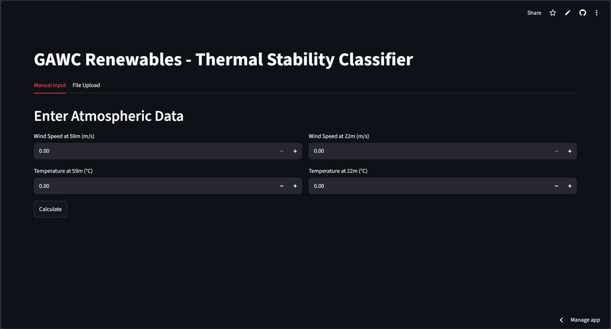
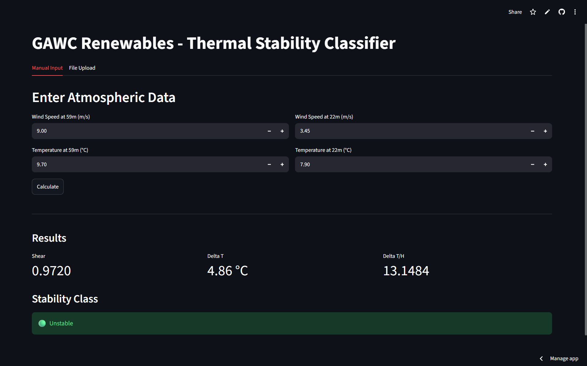
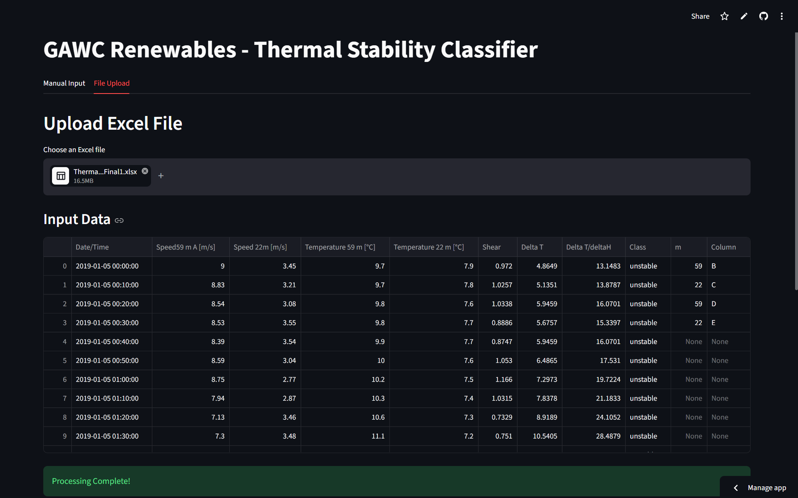
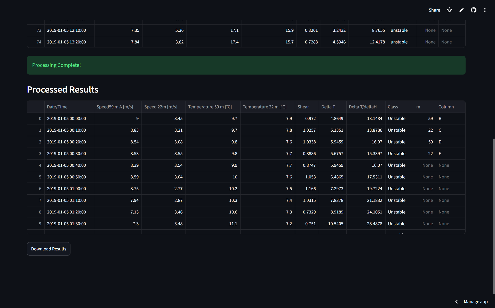

# Atmospheric Thermal Stability Classifier

<p align="center">
  <strong>A Python and Streamlit application for classifying atmospheric thermal stability using wind speed and temperature data from wind masts.</strong>
</p>

<p align="center">
  <a href="https://gawc-thermal-stability-classifier.streamlit.app/">
    
  </a>
  <a href="https://github.com/SHREYA-G-AMIN/gawc-thermal-stability-classifier">
    
  </a>
</p>

<p align="center">
  
</p>

---

## Overview

This project was developed as part of the internship assignment at **GAWC Renewables LLP**.

The objective was to build a Python-based tool capable of classifying **atmospheric thermal stability** using wind speed and temperature measurements collected from wind masts. The original workflow relied on Excel spreadsheets; this application automates the calculations through an interactive web interface.

The application supports both **manual data entry** and **bulk Excel processing**, allowing users to efficiently analyze thousands of atmospheric observations.

---

## Live Demo

**Streamlit Application**

https://gawc-thermal-stability-classifier.streamlit.app/

---

## Features

- Manual atmospheric data input
- Bulk Excel (.xlsx) file processing
- Automatic Wind Shear calculation
- Temperature Difference (ΔT) calculation
- Temperature Gradient (ΔT / ΔH) calculation
- Atmospheric Stability Classification
- Validation for missing columns and invalid values
- Automatic skipping of invalid records while processing valid data
- Download processed results as Excel
- Clean and responsive Streamlit interface

---

## Workflow

1. Enter atmospheric measurements manually or upload an Excel workbook.
2. The application validates the input data.
3. Wind Shear, ΔT and Temperature Gradient are calculated.
4. Atmospheric stability is classified automatically.
5. Results are displayed in tabular format.
6. The processed dataset can be downloaded as an Excel file.

---

## Theory

Atmospheric stability is an important parameter in **Wind Resource Assessment (WRA)** as it influences wind flow characteristics and turbine performance.

This application computes:

- Wind Shear
- Temperature Difference (ΔT)
- Temperature Gradient (ΔT / ΔH)
- Atmospheric Stability Classification

using the methodology provided in the Thermal Stability worksheet.

---

## Technology Stack

| Category | Technology |
|----------|------------|
| Language | Python |
| Framework | Streamlit |
| Data Processing | Pandas |
| Visualization | Plotly |
| Version Control | Git & GitHub |
| Deployment | Streamlit Community Cloud |

---

## Project Structure

```text
gawc-thermal-stability-classifier/
│
├── app.py
├── calculations.py
├── requirements.txt
├── README.md
├── assets/
│   └── banner.png
└── screenshots/
    ├── manual-input.png
    ├── file-upload.png
    └── processed-results.png
```

---

## Installation

Clone the repository

```bash
git clone https://github.com/SHREYA-G-AMIN/gawc-thermal-stability-classifier.git
```

Navigate to the project directory

```bash
cd gawc-thermal-stability-classifier
```

Install the required dependencies

```bash
pip install -r requirements.txt
```

Run the application

```bash
streamlit run app.py
```

---

## Input

### Manual Input

The application accepts the following atmospheric measurements:

- Wind Speed at **59 m**
- Wind Speed at **22 m**
- Temperature at **59 m**
- Temperature at **22 m**

### Excel Upload

Users can upload an Excel workbook containing atmospheric measurements.

The application automatically:

- Reads the dataset
- Validates the required columns
- Performs calculations for every observation
- Skips invalid records
- Generates downloadable results

---

## Output

For each observation, the application computes:

| Output |
|---------|
| Wind Shear |
| Temperature Difference (ΔT) |
| Temperature Gradient (ΔT / ΔH) |
| Atmospheric Stability Classification |

Processed data can be downloaded as an Excel workbook.

---

## Validation

The application was validated using the Thermal Stability workbook provided by **GAWC Renewables LLP**.

Validation included:

- Manual calculation verification
- Comparison with Excel-generated values
- File upload testing
- Invalid value handling
- Missing column validation
- Download verification

---

## Screenshots

### Manual Input



### File Upload



### Processed Results



---

## Contributors

| Name | Contribution |
|------|--------------|
| **Shreya G Amin** | Calculation engine |
| **Manya Jain** | Streamlit user interface and manual input module |
| **Moulya Hegde** | File upload integration, validation, testing and download functionality |


---

## Acknowledgement

This project was developed as part of the internship assignment conducted by **GAWC Renewables LLP** to understand the principles of Atmospheric Stability and implement a Python-based Thermal Stability Classification tool.

---

## License

This project is intended for educational and internship purposes.
